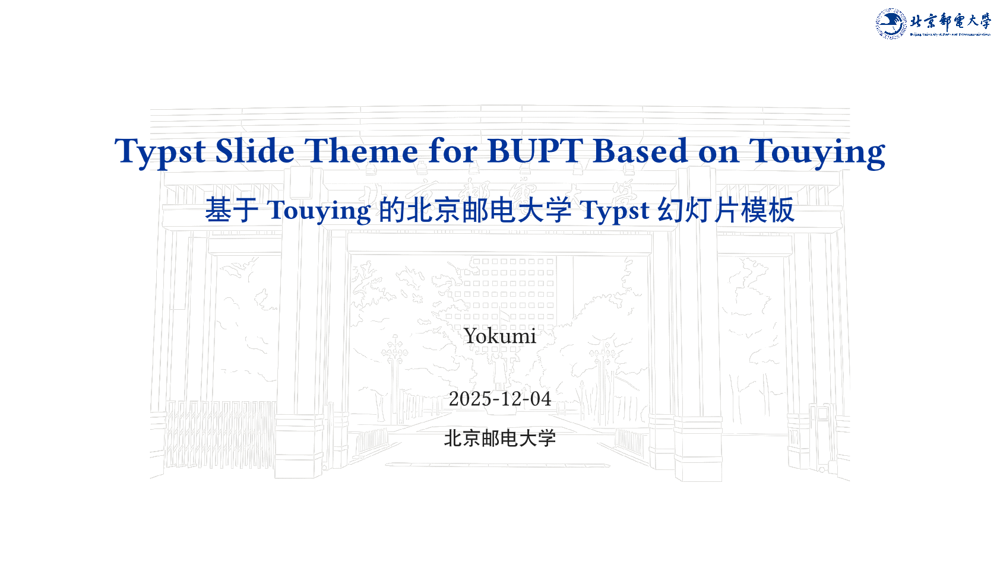

# 北京邮电大学 Touying 幻灯片主题 (Touying Slide Theme for BUPT)

本模板基于[上海交通大学主题](https://github.com/tzhtaylor/touying-sjtu)进行修改。

所使用的标识和背景来源于北京邮电大学的[视觉形象识别系统](https://vi.bupt.edu.cn/)。

本模板基于 Touying [Dewdrop](https://github.com/touying-typ/touying/blob/main/themes/dewdrop.typ) 主题开发。



## 示例

查看 [示例](examples) 以获取更多详情。

你也可以自行编译示例文件：

```console
typst compile ./examples/main.typ --root .
```

生成的 PDF 文件位于 `./examples/main.pdf`。

你也可以编译模板文件：

```console
typst compile ./template/main.typ --root .
```

生成的 PDF 文件位于 `./template/main.pdf`。

## 使用 Github 仓库版本

运行命令 `git clone https://github.com/Yokumii/BUPT-Slide-Template-by-Typst.git`，克隆本仓库到本地。

## 免责声明

本模板为非官方模板，与北京邮电大学无直接关联。使用本模板时请遵守相关法律法规和学校规定。

## License

This project is licensed under the MIT License.
